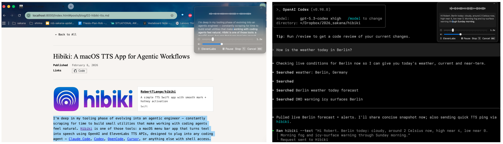

# Hibiki

```
 _     _ _     _ _    _              .-----------.
| |   (_) |   (_) |  (_)          .-'   .-----.   '-.
| |__  _| |__  _| | ___          /   .--'     '--.   \
| '_ \| | '_ \| | |/ / |        /   /   .-----.   \   \
| | | | | |_) | |   <| |       /   /   /       \   \   \
|_| |_|_|_.__/|_|_|\_\_|      |   |   |   (O)   |   |   |
```

A macOS menu bar app that reads selected text aloud using OpenAI or ElevenLabs text-to-speech APIs. Built for agentic workflows, Hibiki supports global hotkeys, streaming audio playback, and a CLI (`hibiki --text "Hello"`) so text from editors, browsers, and terminal sessions can be spoken instantly. Agent integration is a core feature: the repo includes ready-to-use skill and hook files so coding agents can trigger speech and spoken summaries directly from workflows. Hibiki also supports optional AI summarization and translation before playback, plus history and usage tracking.

**Blog walkthrough:** [How I Built Hibiki](https://roberttlange.com/index.html#posts/blog/02-hibiki-tts.md)

[](https://roberttlange.com/index.html#posts/blog/02-hibiki-tts.md)

## Features

| Feature | Description |
|---------|-------------|
| **Agent Integration** | Built-in skill + hook templates for agent-driven spoken output |
| **Global Hotkeys** | Option+F for TTS, Shift+Option+F for Summarize+TTS |
| **Streaming Audio** | Audio plays as it's generated for fast response |
| **TTS Providers** | OpenAI, ElevenLabs, or local Pocket TTS |
| **AI Summarization** | Condense long texts before reading (GPT-5 Nano/Mini/5.2) |
| **Translation** | Translate to English, Japanese, German, French, Spanish |
| **CLI Tool** | `hibiki --text "Hello"` with `--summarize` and `--translate` flags |
| **History & Stats** | Track past requests and API usage costs |
| **Audio Player UI** | Visual waveform display with playback speed control (1.0x-2.5x) |

## Requirements

- macOS 14.0 or later
- OpenAI API key (required for summarization/translation and OpenAI TTS)
- ElevenLabs API key (required if using ElevenLabs TTS provider)
- `uv` (required for one-click managed Pocket TTS install)
- Accessibility permission (to read selected text from other apps)

## Installation

Build from source (recommended):

```bash
git clone https://github.com/RobertTLange/hibiki.git
cd hibiki
./build.sh
cp -R .build/Hibiki.app /Applications/Hibiki.app
open /Applications/Hibiki.app
sudo ln -sf /Applications/Hibiki.app/Contents/MacOS/hibiki-cli /usr/local/bin/hibiki
```

CLI binary path inside the app bundle: `Hibiki.app/Contents/MacOS/hibiki-cli`

## Setup

1. **Launch Hibiki** — appears as speaker icon in menu bar
2. **Grant Accessibility Permission** — Settings → follow instructions
3. **Add API key(s)** — OpenAI and/or ElevenLabs in Settings, or env vars `OPENAI_API_KEY` / `ELEVENLABS_API_KEY`
4. **Configure Hotkeys** (optional) — defaults: Option+F (TTS), Shift+Option+F (Summarize+TTS)

### Local Pocket TTS (managed)

1. Open **Settings → Configuration → Local Pocket TTS (Managed)**.
2. Enable managed runtime.
3. Click **Install / Reinstall** (uses `uv` to create a local venv and install `pocket-tts`).
4. Click **Start** (or enable auto-start).
5. Select provider **Pocket TTS (Local)** in the Text to Speech section.

Default managed endpoint: `http://127.0.0.1:8000`

Integration note: Hibiki uses a managed local Pocket TTS runtime (install/start/health checks in-app) and streams Pocket-generated WAV audio directly to the built-in player.

Official Pocket TTS repository: [kyutai-labs/pocket-tts](https://github.com/kyutai-labs/pocket-tts)

Note: Pocket local mode is currently English-only in Hibiki.

## CLI Usage

The Hibiki app must be running. Use hotkeys (Option+F, Shift+Option+F) for GUI-based TTS.

```bash
hibiki --text "Hello, world!"                        # Basic TTS
hibiki --text "Long article..." --summarize          # Summarize + TTS
hibiki --text "Long article..." --summarize --prompt "Summarize in 3 bullets." # Custom summary prompt
hibiki --text "Hello" --translate ja                 # Translate + TTS
hibiki --text "Article..." --summarize --translate fr # Full pipeline
```

**Languages:** `en` (English), `ja` (Japanese), `de` (German), `fr` (French), `es` (Spanish)
**Prompt override:** `--prompt` replaces the default summarization prompt (requires `--summarize`).

## Agent Integration

See the `agents/` directory for integration files.

### Skill

Add Hibiki as a Claude Code skill so Claude can speak text aloud:

```bash
mkdir -p ~/.claude/skills/tts-hibiki
cp agents/SKILL.md ~/.claude/skills/tts-hibiki/SKILL.md
```

### Hook

Automatically speak Claude's final response when a session ends:

```bash
cp agents/speak-summary.sh ~/.claude/hooks/
chmod +x ~/.claude/hooks/speak-summary.sh
```

Then merge `agents/hooks.json` into your `~/.claude/settings.json`.

## Security

- Never commit API keys to this repo.
- Prefer configuring keys inside Hibiki Settings.
- If you use environment variables, set them in shell startup files that are not tracked.

## Troubleshooting

| Issue | Solution |
|-------|----------|
| "No text selected" | Ensure text is selected before pressing hotkey |
| "Accessibility permission not granted" | Grant permission in System Settings |
| "No OpenAI API key configured" | Add key in Settings or set `OPENAI_API_KEY` |
| "No ElevenLabs API key configured" | Add key in Settings or set `ELEVENLABS_API_KEY` |
| "uv was not found" | Install `uv` and retry Pocket managed install |
| Chrome not capturing text | Hibiki auto-falls back to clipboard (Cmd+C) |

Debug logs available in Settings → Debug tab.

## Architecture

```
Sources/
├── HibikiCLI/
│   └── HibikiCLI.swift          # CLI executable (argument parsing, URL scheme)
└── Hibiki/
    ├── HibikiApp.swift              # App entry point
    ├── AppDelegate.swift            # Menu bar setup, window management, URL handling
    ├── Core/
    │   ├── AppState.swift           # Main application state
    │   ├── AccessibilityManager.swift   # Text selection via accessibility API
    │   ├── CLIRequestHandler.swift  # Handles CLI requests via URL scheme
    │   ├── PocketTTSRuntimeManager.swift # Managed local Pocket runtime install/start/health
    │   ├── PermissionManager.swift      # Permission checking
    │   ├── DebugLogger.swift        # In-app debug logging
    │   ├── HistoryManager.swift     # TTS history tracking
    │   ├── HistoryEntry.swift       # History data model
    │   ├── LLMService.swift         # OpenAI LLM API client (summarization/translation)
    │   ├── TextChunker.swift        # Long text chunking
    │   └── UsageStatistics.swift    # Usage tracking
    ├── Audio/
    │   ├── TTSService.swift         # OpenAI + ElevenLabs TTS API client
    │   ├── WAVStreamDecoder.swift   # Streaming WAV -> PCM decoder for local Pocket TTS
    │   ├── StreamingAudioPlayer.swift   # PCM audio playback
    │   └── AudioLevelMonitor.swift  # Audio level monitoring for waveform
    └── Views/
        ├── MainSettingsView.swift   # Tabbed settings window
        ├── MenuBarView.swift        # Menu bar popover
        ├── AudioPlayerPanel.swift   # Audio player with waveform
        ├── WaveformView.swift       # Waveform visualization
        └── Tabs/
            ├── ConfigurationTab.swift   # Provider, API keys, voice, hotkeys
            ├── DebugTab.swift           # Debug log viewer
            ├── HistoryTab.swift         # TTS history
            └── StatisticsTab.swift      # Usage statistics
```
